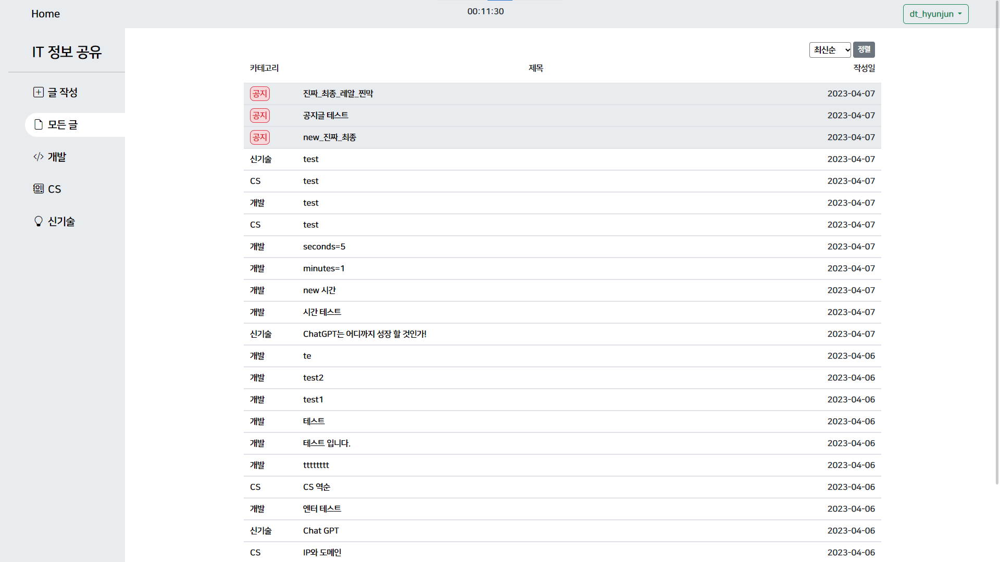

# 개발자 정보 공유 서비스
KDT-2기 풀스택 미니 프로젝트

개발기간 : 2023-04-06 ~ 2023-04-07

# 기술 스택

### Environment

### Development

  
  
  
  
  

### Communication

# Updates

- 2023-04-12
  
  프로필 이미지 업로드/삭제 기능 구현

  *User 모델에 image필드 추가*

- 2023-04-16

  post:detail 페이지에 user 정보 추가.

  profile/ -> <int:user_pk>/profile/ 변경

- 2023-04-17

  profile 페이지 권한 변경

  detail 페이지에 댓글 기능 추가

  three dots 에 수정/삭제 기능 구현 (예정) -> 복잡한 js가 필요하므로 (중단)

- 2023-04-18

  댓글 삭제 기능 추가

  본인 댓글 하이라이트, 마우스오버 시 삭제버튼 나타냄

  댓글목록 table 형식으로 제작 (예정)

# Bug Report

- 2023-04-11
  > 글 작성시 공지 글 체크박스를 체크해야만 작성이 되던 버그 수정

  *PostForm에 required=False를 추가하여 해결*